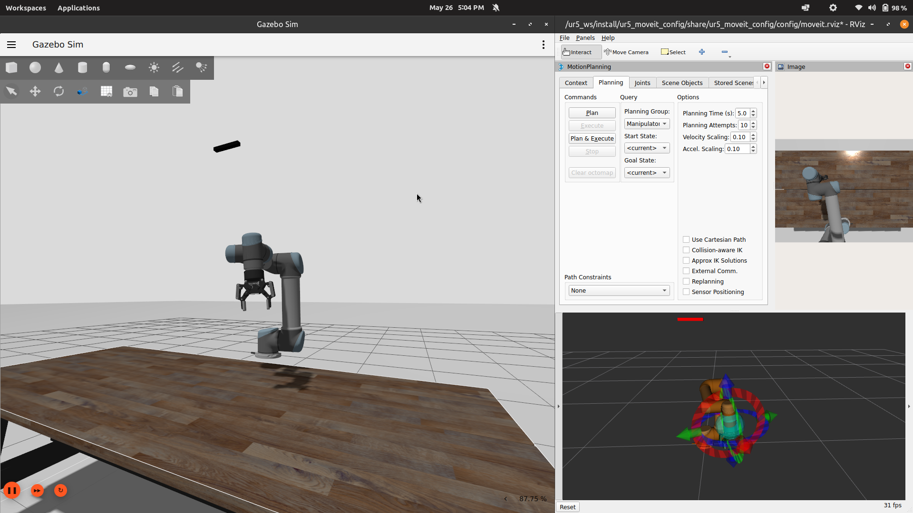

# UR5 Pick and Place Simulation

This project simulates a **UR5 robotic arm** performing a **pick and place** operation using **ROS 2**, **Gazebo**, and **MoveIt 2**. The robot can plan and execute motion to pick up an object and place it at a designated location.

 

## Features

* Simulated UR5 robot in Gazebo
* Motion planning using MoveIt 2
* Pick and place functionality
* RViz integration for visualization

## Prerequisites

* ROS 2 (Jazzy)
* Gazebo (Harmonic)
* MoveIt 2
* `ros2_control` and `ros2_controllers`
* UR5 description and MoveIt packages

## Setup Instructions

```bash
# Clone the repository
git clone <your-repo-url>
cd <your-workspace>

# Install dependencies
rosdep install --from-paths src --ignore-src -r -y

# Build the workspace
colcon build

# Source the workspace
source install/setup.bash
```

## Running the Simulation

1. **Launch the simulation:**

```bash
ros2 launch ur5_pick_place_sim ur5_gazebo.launch.py
```

2. **Launch MoveIt and RViz:**

```bash
ros2 launch ur5_pick_place_sim ur5_moveit.launch.py
```

3. **Run the pick and place node:**

```bash
ros2 run ur5_pick_place_sim pick_and_place_node
```

## Folder Structure

```
ur5_pick_place_sim/
├── config/                # MoveIt and controller configurations
├── launch/                # Launch files for Gazebo and MoveIt
├── models/                # Gazebo models for objects/environment
├── src/                   # Source code for pick and place node
├── urdf/                  # UR5 and world description files
└── README.md
```

## License

This project is licensed under the MIT License.

---

Let me know if you want to include details like ROS 2 launch parameters, object manipulation specifics, or controller tuning.
